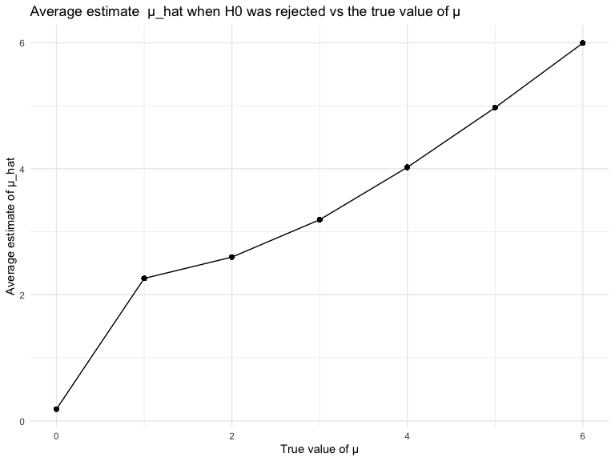

p8105_hw5_vas2145
================
Victoria Schliep
2023-11-15

\#Problem 2

Read in and tidy the data

``` r
tidy_df =
  names_df |> 
  mutate(
    files = str_replace(files, ".csv", ""),
    arm = str_sub(files, 1, 3),
    ID = str_sub(files, 5, 7)) |> 
  pivot_longer(
    week_1:week_8,
    names_to = "week",
    values_to = "observation",
    names_prefix = "week_") |> 
  mutate(week = as.numeric(week)) |> 
  select(arm, ID, week, observation)
```

Spaghetti plot showing observations on each subject over time.

``` r
tidy_df |> 
  ggplot(aes(x = week, y = observation, color = ID)) +
  geom_line() +
  facet_wrap(~arm) +
  labs(x = "Week", y = "Observations", title = "Observations on Subjects over Time")
```


The `tidy_df` output depicts observations on subjects over time, from
the control group and the experimental group. Although observed data
points in the control group were generally similar to the observed data
points in the experimental group at the start of the study (week 0),
observed data points in the experimental group increased over time in
comparison to the control group.

\#Problem 3

``` r
sim_mean = function(mu) {
  data = tibble(
    x = rnorm(n=30, mean = mu, sd = 5),
  )
output = data |>
  t.test() |>
  broom::tidy() |>
  select(estimate, p.value) |>
  rename(mu_hat=estimate, pval=p.value)
}
```

``` r
sim_results = expand_grid(
  mu_df = c(0, 1, 2, 3, 4, 5, 6),
  iter = 1:5000) |>
  mutate(
    estimate = map(mu_df, sim_mean)
    ) |>
  unnest(estimate)
```

``` r
sim_results |>
  group_by(mu_df) |> 
  summarise(
    reject = sum(pval < 0.05),
    proport = reject/5000) |> 
  ggplot(aes(x = mu_df, y = proport)) +
  geom_point() +
  geom_line() +
  labs(x = "True value of μ", y = "Power", title = "Power of test vs true value of μ")
```


``` r
sim_results |> 
  group_by(mu_df) |> 
  mutate(mu_hat_avg = mean(mu_hat)) |> 
  ggplot(aes(x = mu_df, y = mu_hat_avg)) +
  geom_point() +
  geom_line() +
  labs(x = "True value of μ", y = "Average estimate of μ_hat", title = "Average estimate of μ_hat vs true value of μ")
```


``` r
sim_results |> 
  group_by(mu_df) |> 
  filter(pval<0.05) |> 
  mutate(mu_hat_avg = mean(mu_hat)) |> 
  ggplot(aes(x = mu_df, y = mu_hat_avg)) +
  geom_point() +
  geom_line() +
  labs(x = "True value of μ", y = "Average estimate of μ_hat", title = "Average estimate  μ_hat when H0 was rejected vs the true value of μ")
```


